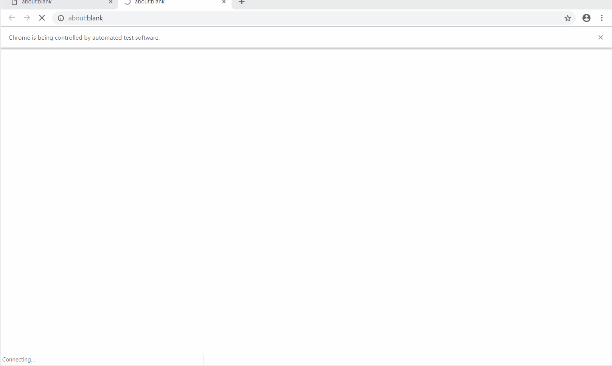

# Demo
Demo to create a github new repo
```bash
uiauto "create-github-repo.json"
```



# Setup
```
npm i -g uiauto
```
# Options
* -f, --file         Test sequence json file (defalut option)
* -p, --parallel     Parallel execution count
* -s, --serial       Serial execution count
* -l, --headless     Head less chrome
* -t, --timeout      Navigation timout
* -n, --noquit       Do not close browser once done
* -v, --version      Version

# Example
* Run one execution sequence, this is demo for creating a new github repo automatically.
```bash
uiauto "github-create-repo.json"
```

* Run 5 execuation sequences in parallel
```bash
uiauto "github-create-repo.json" -p 5
```

* Run one execution sequence with 5 times loop
```bash
uiatuo "github-create-repo.json" -s 5
```

[github-create-repo.json](/examples/github-create-repo.json) stored the data of UI automation.

# Definition of data file
```json
{
    "description": "",
    "siteUrl": "",
    "creds": [
        {
            "username": "",
            "password": ""
        }
    ],
    "data": [
        {
            "description": "",
            "data": "",
            "interval": 2,
            "delay": 1,
            "textbox": true,
            "navigation": true,
            "ignore": true,
            "value": "",
            "cred": "username"
        }
    ]
}
```
## Details of each field

| Fields | Type | Description |
| ------------- |:-------------:| -----:|
| description | String | Description of test sequence |
| siteUrl | String | The url of web site, the automation tool will run |
| creds | Array | Type of each item is object, stored data for typing |
| data | Array | Type of each item is object, each object is an action |

### Details of each action field
| Action Fields | Type | Description |
| ------------- |:---: | ----------: |
| description | String | Descripton of this action |
| data | String | XPath, suggest to use a very details XPath, with more information more stable, such as class, id, sibiling index, text value and top to BODY. Suggest to use this Chrome extension [Full XPath](https://chrome.google.com/webstore/detail/full-xpath/ofjlfbcpbobinkhbhgmmffaojoaghjjc?utm_source=chrome-ntp-icon) to copy XPath |
| interval | Number | Timeout of finding element by XPath, Unit: second |
| delay | Number | The delay time to execute this action, unit: second, default value is one second |
| textbox | Boolean | Whether the element is a textbox element, such as input[type="text"] or input[type="password"] |
| navigation | Boolean | Exist a navigation after the action executed |
| ignore | Boolean | If do not find element by XPath, the action will be ignored |
| value | Any | This field is for textbox type element, it will be convered when *cred* filed is exist |
| cred | String | its value is the key of *creds* above, it's for textbox type element |

# Why use a full XPath
Using a ful XPath with more details(class, id, sibiling index, text value) and top to BODY. Because used a dynamica locating a algorithm, which help to resolve XPath break when page changed, for example, the position of parent or brother elements is changed. The sytle changed such as class name updated.